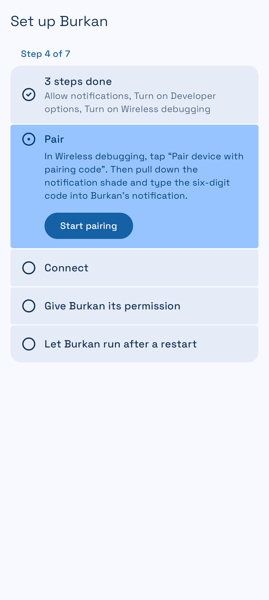
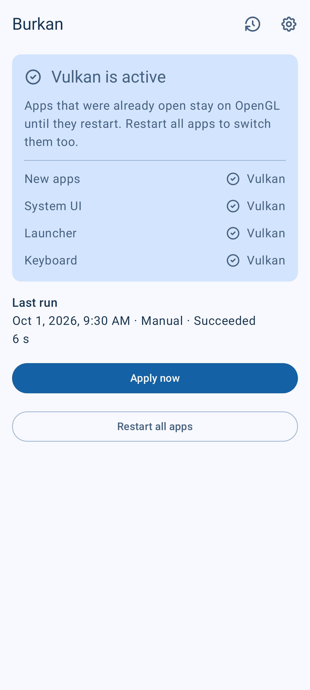
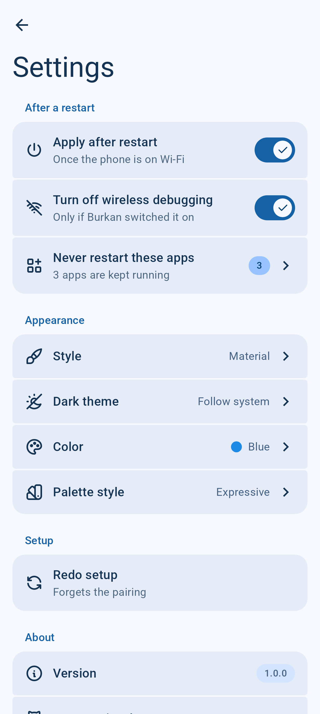
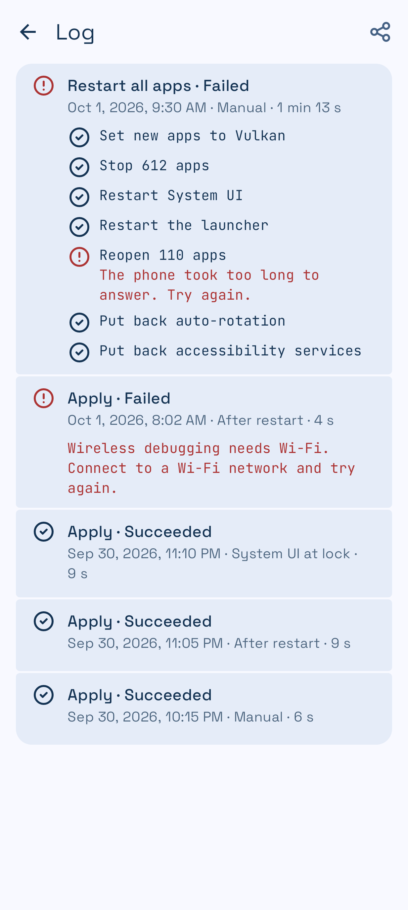

# Burkan

Keeps the Vulkan renderer active on a Samsung Galaxy S23 — without a computer, and without redoing it after
every restart.

Android's UI renderer is chosen by a system property, `debug.hwui.renderer`, that only the `shell` user can
set and that resets on every reboot. Burkan pairs once with the phone's own wireless debugging, then
re-applies Vulkan by itself after each restart. No root, no Shizuku, no network access beyond the phone talking
to itself.

> **Status: early.** Setup, applying, and the automatic run after a restart have been verified on a Galaxy S23
> (Android 16). What is still unchecked is listed in [`docs/testing.md`](docs/testing.md).

| Setup | Home | Home, dark | Settings | Log |
|---|---|---|---|---|
|  |  |  |  |  |

The pictures are the app's screenshot tests, rendered from its previews with sample data.

## What it does

- **After every restart**, once the phone is on a Wi-Fi network that allows wireless debugging, it switches
  wireless debugging on, connects to the phone itself on `127.0.0.1`, sets Vulkan, restarts System UI, the
  launcher and the keyboard so they pick it up, and switches wireless debugging off again. If the phone is not on
  Wi-Fi yet, it waits and applies when it connects.
- **Shows what is really running**: the renderer new apps will get, and the one System UI, the launcher and the
  keyboard are using now.
- **Apply now** does the same as the restart run. **Restart all apps** also restarts every other app so each one
  comes back on Vulkan, then puts back what that disturbs (auto-rotation, accessibility services, Edge panels).
  Apps you choose in Settings are never restarted.
- **Keeps a log** of the last 50 runs, step by step. It can be shared as a `.log` file and never contains package names
  or the app's key.

## Requirements

- A Galaxy S23, S23+ or S23 Ultra. Other phones get a warning; the app makes no promises about them.
- Android 13 or later.
- A Wi-Fi network you have marked "Always allow" for wireless debugging. Without Wi-Fi, Android does not run
  wireless debugging, so nothing can be applied until the phone connects.

## Setting it up

Install the app and open it. It walks you through a checklist and moves on by itself as each step is done:

1. **Allow notifications.** The pairing code is typed into a notification, and failures are reported there.
2. **Turn on Developer options**: Settings › About phone › Software information, tap *Build number* seven times.
3. **Turn on Wireless debugging** in Developer options, and tick *Always allow on this network*.
4. **Pair.** In Wireless debugging, tap *Pair device with pairing code*, then pull down the notification shade
   and type the six-digit code into Burkan's notification. Do not leave the pairing dialog: Android closes
   it when you leave Settings.
5. **Connect** and **permission** happen on their own: Burkan connects and grants itself the permission to
   switch wireless debugging on and off.
6. **Battery.** Allow Burkan to ignore battery optimisation, so the run after a restart is not held back.
   You can skip this.

From then on, there is nothing to do. Home shows the result; if a run cannot happen yet, a card says what it is
waiting for.

## Privacy

The only connection the app makes is to the phone itself. No analytics, no crash reports, no update checks. The
ADB key stays in encrypted storage and is excluded from backups.

## Building

Requires the Android SDK (platform 37). The JDK is resolved by Gradle.

```bash
./gradlew :app:assembleDebug
./gradlew :app:testDebugUnitTest :app:verifyRoborazziDebug
./gradlew :app:assembleRelease
```

The release build is minified. It is signed when a `keystore.properties` file sits next to
`settings.gradle.kts`, and left unsigned otherwise:

```properties
storeFile=/path/to/release.jks
storePassword=…
keyAlias=…
keyPassword=…
```

Never commit that file or the keystore; both are in `.gitignore`.

## Documents

- [`docs/architecture.md`](docs/architecture.md) — what the app does, its screens and how it is built.
- [`docs/device-notes.md`](docs/device-notes.md) — the shell commands involved and what was measured on a real
  S23.
- [`docs/testing.md`](docs/testing.md) — what has been verified on a phone and what has not.
- [`CONTRIBUTING.md`](CONTRIBUTING.md) — building, testing and the code conventions.

## Background

The approach comes from the community scripts in
[s23-vulkan-support](https://github.com/Ameen-Sha-Cheerangan/s23-vulkan-support), which do the same from a
computer over ADB. This app moves that onto the phone and corrects several things those scripts get wrong; the
details are in the device notes.

Forcing Vulkan is unsupported by Samsung and Google. A restart always returns the phone to OpenGL until
Burkan applies it again.

## Licence

Copyright 2026 Mohammed Barq AL Layl.

Burkan is licensed under the [Apache License, Version 2.0](LICENSE). It is distributed on an "as is" basis,
without warranties or conditions of any kind; see the licence for details.

The libraries it is built with keep their own licences, listed in the app under Settings › Open-source
licences. `libadb-android` is used under its Apache-2.0 option, and its pairing helper `spake2-java` under the
LGPL-3.0.
