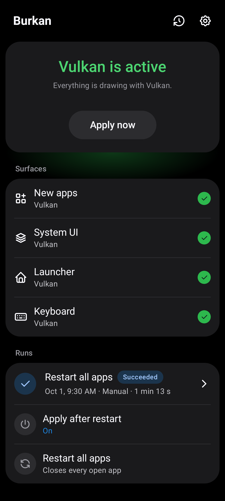
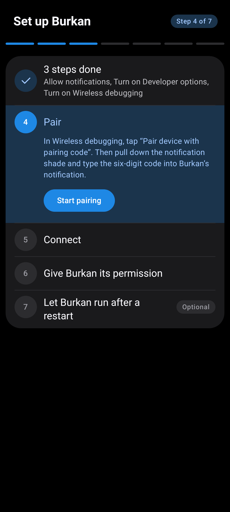
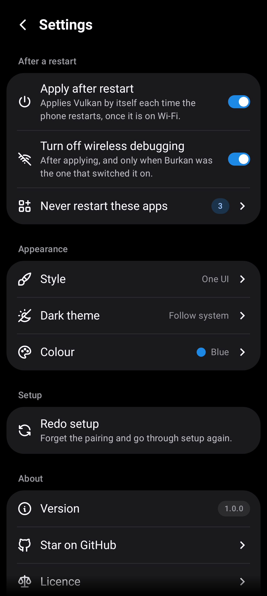
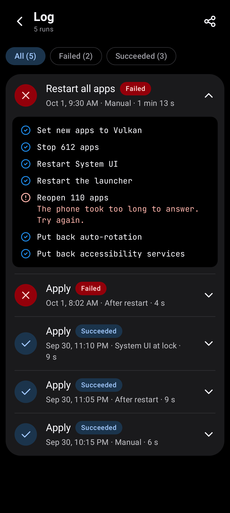
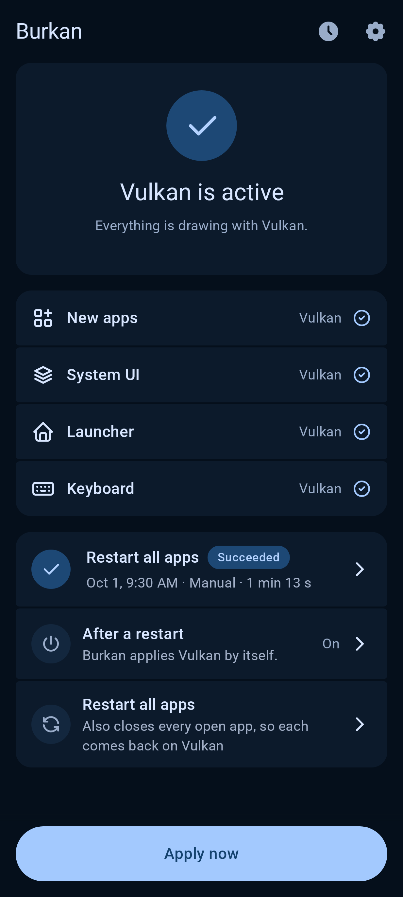
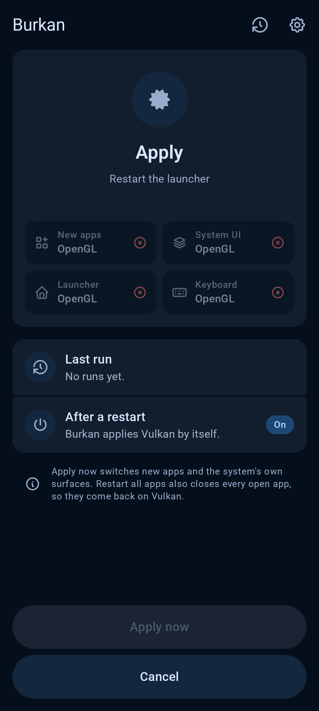
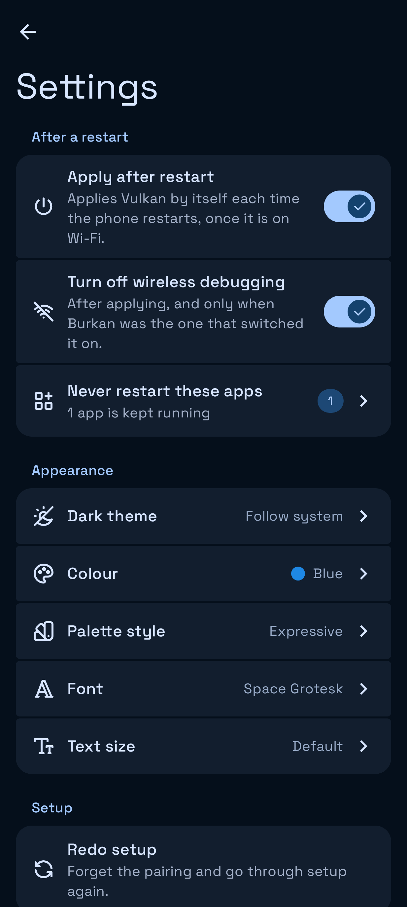
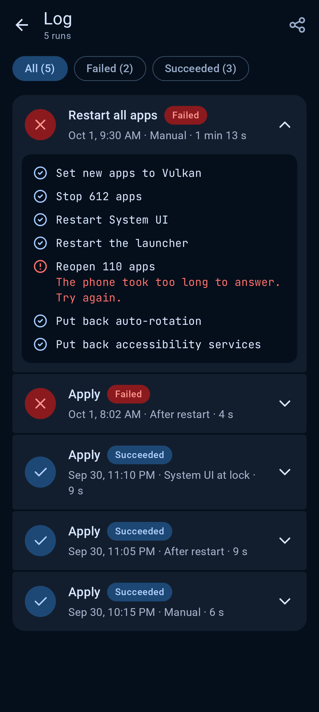

<div align="center">


# Burkan

### Autonomous Vulkan rendering for Samsung Galaxy S23. No computer, no root, zero hassle.

<br/>

[](https://github.com/barq-al-layl/Burkan/releases/latest)
[](https://www.android.com)
[](https://news.samsung.com/global/galaxy-s23-series)
[](LICENSE)
[](#safe-by-design)

<br/>

[**Download**](#download) · [**Features**](#features) · [**Screenshots**](#screenshots) · [**Quick Setup**](#quick-setup) · [**Safe by Design**](#safe-by-design) · [**For Developers**](#for-developers) · [**FAQ**](#faq)

</div>

---

## Overview

On Samsung Galaxy S23 devices, switching Android's UI rendering pipeline from OpenGL to **Vulkan** (`skiavk`) is widely reported by the S23 community to yield smoother animations, reduced thermal throttling, and better battery efficiency. However, Android resets this setting on every reboot, and modifying it requires privileged shell permissions.

Historically, this meant tethering your phone to a PC with a USB cable after every restart, or maintaining complex third-party terminal environments.

**Burkan solves this entirely on-device.** By pairing once with your phone's native Wireless Debugging service and connecting to it locally (loopback `127.0.0.1` first, the phone's own Wi-Fi address as a fallback), Burkan autonomously re-enables Vulkan every time your device restarts—silently and without a computer.

<br/>

<div align="center">

| ❄️ Cooler Thermals | 🔋 Extended Battery | ⚡ Smoother UI | 📱 100% On-Device |
| :---: | :---: | :---: | :---: |
| Lower operating temperatures during sustained daily usage | Reduced GPU overhead compared to legacy OpenGL rendering | Consistent frame delivery across One UI system surfaces | No PC, no root, and no external background daemons needed |

<sub>The first three are what S23 owners commonly report after switching to Vulkan. Burkan applies and verifies the renderer; it does not measure temperature, battery, or frame rate itself.</sub>

</div>

---

## Features

<table>
  <tr>
    <td width="50%" valign="top">

### 🔄 Autonomous Persistence
- **Zero-touch boot restoration:** Re-applies Vulkan automatically upon reboot as soon as connected to Wi-Fi.
- **Seamless System UI handling:** Defers System UI refresh until the next screen lock so your phone never locks in front of you.
- **Automatic cleanup:** Turns Wireless Debugging back off once applied (if Burkan was the one that enabled it).
- **Smart network detection:** If the phone restarts without Wi-Fi, Burkan waits and applies the moment a trusted network connects. It keeps the device awake only for the short time a run takes.

</td>
    <td width="50%" valign="top">

### 🎯 Granular Control
- **Apply Now:** Instantly applies Vulkan to the system property and core surfaces (System UI, Launcher, Keyboard).
- **Restart All Apps:** Intelligently closes and relaunches background apps and home widgets so they adopt Vulkan. Choose to restart every app, or limit to the 30 or 70 most recently used.
- **Custom exclusions:** Protect critical background apps, media players, or banking tools from ever being restarted.

</td>
  </tr>
  <tr>
    <td width="50%" valign="top">

### 🔍 Complete Transparency
- **Real-time status inspector:** Verifies whether Vulkan is actually active across New Apps, System UI, Home Launcher, and Samsung Keyboard.
- **Detailed run history:** Step-by-step progress ticker and an on-device audit log preserving the last 50 runs.
- **Safe error reporting:** Plain-language diagnostics when a connection or system step cannot proceed.

</td>
    <td width="50%" valign="top">

### 🎨 Native Dual-Engine Design
- **One UI style:** Meticulously styled to feel indistinguishable from Samsung's stock system apps.
- **Material 3 Expressive:** Full Material You dynamic theming powered by MaterialKolor.
- **Dark & light modes:** Smooth fluid circular reveals on theme changes.

</td>
  </tr>
</table>

---

## Screenshots

<div align="center">

### One UI Experience *(Default on Samsung)*
<p align="center">
  
  
  
  
</p>

### Material 3 Expressive
<p align="center">
  
  
  
  
</p>

</div>

---

## Download

| Source | Channel | Status |
| :--- | :--- | :--- |
| [**GitHub Releases**](https://github.com/barq-al-layl/Burkan/releases/latest) | APK (Direct Download) | Stable (`v1.0.0`) |
| [**F-Droid**](docs/f-droid.md) | F-Droid Repository | Planned — Metadata & Recipe Prepared |
| [**Obtainium**](https://github.com/ImranR98/Obtainium) | Add Repo URL | Auto-update supported |

---

## Quick Setup

> [!NOTE]
> **Prerequisites:** A Samsung Galaxy S23, S23+, or S23 Ultra running Android 13 or newer, connected to Wi-Fi. Tested on One UI 8.5 (Android 16).

Setup takes less than 2 minutes and only needs to be completed once:

1. **Install Burkan:** Download the APK from [Releases](https://github.com/barq-al-layl/Burkan/releases/latest) and install it on your device.
2. **Follow the interactive guide:** Burkan walks you through allowing notifications and enabling *Developer Options* and *Wireless Debugging*, one step at a time.
3. **Pair from the notification shade:** Tap *Pair device with pairing code* in Developer Options, pull down your notification tray, and enter the 6-digit code into Burkan's prompt.
4. **Done:** Burkan grants itself the necessary secure settings permission, requests battery optimization exemption to protect boot runs, and automatically takes over boot maintenance.

---

## Safe by Design

- 🔒 **Zero Telemetry & Local Only:** Burkan never connects to the internet. `android.permission.INTERNET` is declared only to reach the phone's own `adbd` daemon, and the single thing that touches your Wi-Fi network is Android's standard local service discovery (mDNS), used to find the Wireless Debugging port. There are zero remote network calls, no analytics, no crash uploaders, and no ads.
- 🛡️ **Knox Warranty Safe:** Does not unlock the bootloader or modify system partitions. Your Knox warranty (`0x0`) remains intact.
- 🔑 **Encrypted Credentials:** ADB pairing keys (2048-bit RSA) are securely stored on-device using Android Keystore via KSafe, and explicitly excluded from cloud backups and device migration transfers.
- 🔁 **Non-Destructive & Easily Reversible:** Android resets `debug.hwui.renderer` back to OpenGL upon standard reboot. If you ever want to revert, simply turn off *Apply after restart* in Burkan Settings and restart your phone.

---

## For Developers

Burkan is built as an open, modern Android reference application:

```
io.github.barqallayl.burkan
├── core/
│   ├── di/          Metro dependency injection graph (@DependencyGraph)
│   ├── model/       Domain models and typed AppError hierarchy
│   ├── navigation/  Navigation 3 type-safe routes & transitions
│   ├── shell/       Shell commands, executors & renderer parsing
│   └── storage/     DataStore Preferences for settings & device state
├── designsystem/    BurkanTheme, MaterialKolor seeds, M3 Expressive components
└── feature/
    ├── connection/  On-device ADB client (libadb-android, Conscrypt, SPAKE2) & KSafe key storage
    └── …            MVI features (setup, status, apply, settings, log)
```

### Architecture Highlights
- **UI:** Jetpack Compose with Material 3 Expressive components and custom segmented layouts.
- **Dependency Injection:** [Metro](https://github.com/ZacSweers/metro) compiler plugin for build-time graph validation.
- **State & MVI:** [Orbit MVI](https://github.com/orbit-mvi/orbit-mvi) with container host lifecycles.
- **Navigation:** [Navigation 3](https://developer.android.com/guide/navigation) with serialized type-safe keys.
- **Error Handling:** Functional error pipelines with [Arrow](https://arrow-kt.io/) `Either<AppError, T>`.
- **Screenshot Testing:** Every Compose preview doubles as a screenshot test via [Roborazzi](https://github.com/takahirom/roborazzi) running on Robolectric.

### Building & Verification

Requires JDK 25 and Android SDK Platform 37.

```bash
# Compile debug APK
./gradlew :app:assembleDebug

# Run unit tests and Orbit container tests
./gradlew :app:testDebugUnitTest

# Verify UI screenshot baselines with Roborazzi
./gradlew :app:verifyRoborazziDebug

# Assemble release APK
./gradlew :app:assembleRelease
```

For detailed guides, explore our documentation:
- [`docs/architecture.md`](docs/architecture.md) — System design, state flows, and service lifecycles.
- [`docs/device-notes.md`](docs/device-notes.md) — Exact shell commands and real S23 hardware timings.
- [`docs/testing.md`](docs/testing.md) — Physical device test matrix and verification status.
- [`CONTRIBUTING.md`](CONTRIBUTING.md) — Code style, pull request rules, and testing standards.

---

## FAQ

<details>
<summary><b>Does this work on devices other than the Galaxy S23 series?</b></summary>
<br>
Burkan was specifically designed and calibrated for the Qualcomm Snapdragon 8 Gen 2 for Galaxy, and verified on the Galaxy S23 (SM-S911) and S23 Ultra (SM-S918). The S23+ (SM-S916) shares the same platform and is treated as supported. While Burkan opens on other devices with a warning, renderer stability varies significantly across different SoCs and OEM skins.
</details>

<details>
<summary><b>Why does Burkan need Wi-Fi to function?</b></summary>
<br>
Android's native Wireless Debugging daemon only operates while the device is connected to a local Wi-Fi network. Once it is running, Burkan connects to it on the phone itself to execute the renderer update command; the Wi-Fi network is what lets Android switch the daemon on, not where the commands travel.
</details>

<details>
<summary><b>How can I verify that Vulkan is genuinely active?</b></summary>
<br>
Burkan inspects active surface pipelines directly via <code>dumpsys gfxinfo</code> on the Home dashboard. You can also independently verify it by enabling <b>GPUWatch</b> in Android Developer Options and opening any application.
</details>

---

## Acknowledgements

- Inspired by the open-source research and scripts in [s23-vulkan-support](https://github.com/Ameen-Sha-Cheerangan/s23-vulkan-support).
- Built upon [libadb-android](https://github.com/MuntashirAkon/libadb-android) for native ADB protocol support.

---

## License

Copyright © 2026 Mohammed Barq AL Layl.

Licensed under the [Apache License, Version 2.0](LICENSE).

Third-party libraries retain their own licenses: `libadb-android` is used under its Apache-2.0 option, and its pairing helper `spake2-java` under the LGPL-3.0. A complete list of dependency licenses is accessible in the app under **Settings › Open-source licences**.
