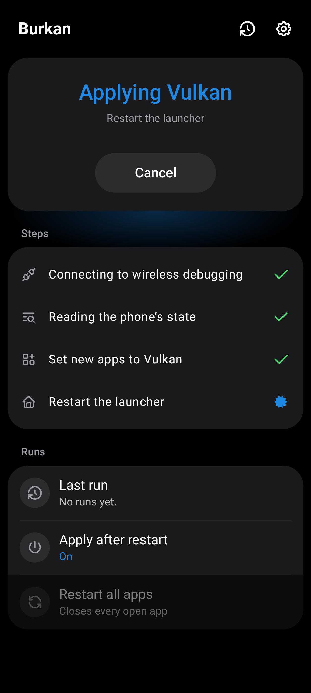
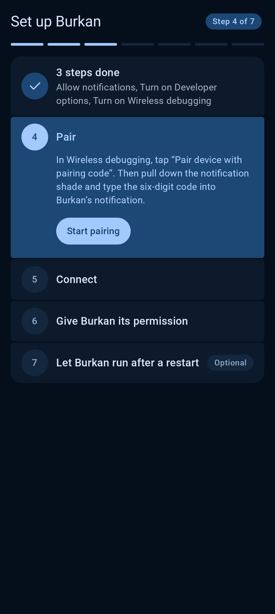

# Burkan

Burkan keeps your Galaxy S23 on Vulkan, the faster way for the phone to draw its screen. Set it up once, in a
few minutes, and it looks after itself from then on, even after a restart. No computer needed.

## Get started

**You need** a Galaxy S23, S23+ or S23 Ultra, connected to Wi-Fi.

1. **Install Burkan.** Download the latest version from the
   [Releases page](https://github.com/barq-al-layl/Burkan/releases/latest) and open the file on your phone.
2. **Open it and follow the steps.** Burkan shows you one step at a time and tells you exactly what to tap.
   When a step is finished, tap **Done** to go to the next.
3. **That's all.** Burkan now turns Vulkan on by itself every time the phone restarts.

### The steps, if you want to see them first

There are seven, and Burkan does two of them for you.

| | Step | What you do |
|---|---|---|
| 1 | Allow notifications | Tap *Allow*. |
| 2 | Turn on Developer options | In the phone's Settings, open *About phone*, then *Software information*, and tap *Build number* seven times. |
| 3 | Turn on Wireless debugging | Open *Developer options*, switch on *Wireless debugging*, and tick *Always allow on this network*. |
| 4 | Pair | In *Wireless debugging*, tap *Pair device with pairing code*. Pull down the notification shade and type the six-digit code into Burkan's notification. |
| 5 | Connect | Nothing. Burkan does it. |
| 6 | Permission | Nothing. Burkan does it. |
| 7 | Battery | Tap *Allow* so Burkan is not held back after a restart, or skip it. |

### If you get stuck

- **The Wireless debugging switch is grey.** The phone is not on Wi-Fi. Connect to a Wi-Fi network and try again.
- **The pairing code disappeared.** It goes away when you leave the pairing screen. Tap *Pair device with
  pairing code* again and use the new code.
- **Burkan says it cannot connect.** Check that the phone is on Wi-Fi, then tap *Try again*.
- **You want to start over.** Open Burkan's Settings and tap *Redo setup*.

## What Burkan does for you

- **Turns Vulkan back on after every restart**, as soon as the phone is on Wi-Fi. You do not need to open it.
- **Shows you what is going on.** Home tells you whether Vulkan is active. If it cannot check, it says why in
  plain words.
- **Lets you do it yourself, too.** *Apply now* switches to Vulkan on the spot. *Restart all apps* also reopens
  your apps so they pick it up. You can choose apps that should never be restarted.
- **Shows its work.** You see each step ticked off while it is busy, and a log keeps the last 50 runs.
- **Fits your taste.** Pick the look, a light or dark theme, and a color.

## Good to know

- **It is safe to try.** If anything looks odd, restart the phone and it is back to normal. To stop Burkan from
  applying Vulkan again, switch off *Apply after restart* in its Settings first.
- **It is private.** Burkan only talks to your own phone. It does not go online, collects nothing about you,
  and has no ads.
- **It needs nothing extra.** No computer, no root, no other apps.
- **It is new.** Burkan has been tried on a Galaxy S23 with One UI 8.5. It opens on other phones with a warning,
  but it is not tested there. Samsung and Google do not officially support forcing Vulkan.

## How it looks

Burkan comes in two looks. On a Samsung phone it starts in **One UI**, so it feels like one of the phone's own
apps. You can switch to **Material** in Settings. Both also have a light theme.

**One UI**

| Setup | Home | During a run | Settings | Log |
|---|---|---|---|---|
|  |  |  |  |  |

**Material**

| Setup | Home | During a run | Settings | Log |
|---|---|---|---|---|
|  |  |  |  |  |

These pictures are made from the app itself with sample data.

## For developers

You need the Android SDK (platform 37). Gradle fetches the right JDK by itself.

```bash
./gradlew :app:assembleDebug
./gradlew :app:testDebugUnitTest :app:verifyRoborazziDebug
./gradlew :app:assembleRelease
```

The release build is signed when a `keystore.properties` file sits next to `settings.gradle.kts`, and left
unsigned otherwise:

```properties
storeFile=/path/to/release.jks
storePassword=…
keyAlias=…
keyPassword=…
```

Never commit that file or the keystore; both are in `.gitignore`.

More detail lives in these documents:

- [`docs/architecture.md`](docs/architecture.md): how the app is put together.
- [`docs/device-notes.md`](docs/device-notes.md): what Burkan does on the phone, and what was measured on a real
  S23.
- [`docs/testing.md`](docs/testing.md): what has been checked on a phone and what has not.
- [`docs/f-droid.md`](docs/f-droid.md): what is ready for publishing on F-Droid and what is still to do.
- [`CONTRIBUTING.md`](CONTRIBUTING.md): building, testing and the code conventions.

## Thanks

The idea comes from the community scripts in
[s23-vulkan-support](https://github.com/Ameen-Sha-Cheerangan/s23-vulkan-support), which do the same job from a
computer. Burkan brings it onto the phone.

## License

Copyright 2026 Mohammed Barq AL Layl.

Burkan is licensed under the [Apache License, Version 2.0](LICENSE). It is provided "as is", without warranties
or conditions of any kind; see the license for details.

The libraries it is built with keep their own licenses, listed in the app under Settings › Open-source
licences. `libadb-android` is used under its Apache-2.0 option, and its pairing helper `spake2-java` under the
LGPL-3.0.
